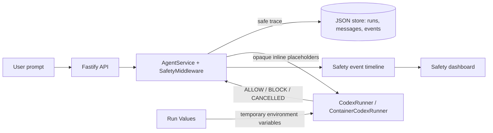

# Safety Middleware Hackathon Submission

This document is the repository handoff and the runbook for the three-minute
live demo. All values in examples are deliberately fake. Do not enter real
credentials into a demo prompt, a recording, or a commit.

## 1. Problem and rationale

An Agent platform creates a security visibility gap: a user prompt can reach an
LLM and a code-execution runtime before anyone can see whether it contained a
credential, personal data, a prompt-injection attempt, or an unsafe execution
outcome. A plain chat UI also makes these decisions invisible to the user.

This project adds an end-to-end safety middleware boundary. It detects and
redacts sensitive content, blocks high-risk prompt injection, keeps inline
values out of persisted traces and LLM input, records execution-boundary
decisions, and displays the result on a safety dashboard.

The goal is not to claim production compliance. The goal is to make an actual
Agent Run safer and its decisions inspectable.

## 2. Setup

### Requirements

- Node.js 22+ and npm 10+
- Docker, Colima, or Podman
- A Volcengine Ark Responses-compatible endpoint

### Start the real end-to-end POC

Set credentials in your shell or local `.env`; never show their values in the
recording:

```bash
cd /path/to/TeamTree
ARK_API_KEY=your-ark-api-key ARK_MODEL=ep-your-endpoint-id npm run poc
```

Open <http://localhost:3000>. Keep the terminal running. 

## 3. Design summary



### Main decisions

- **API / Service:** provider-secret, generic credential, PII, and
  prompt-injection rules are evaluated before a Runner is started. PII rules
  are also tagged by compliance frameworks.
- **Vault-backed inline protection:** inline matched values become
  `[REDACTED_SECRET]` or `[REDACTED_PII]` in persistence and an opaque
  `[PRIVATE_…]` placeholder in the LLM execution prompt.
- **Offline confidence score:** generic credential assignments use Shannon
  entropy plus a local logistic-regression score. UUIDs, Git SHA values, and
  ordinary Base64 are suppressed to reduce false positives.
- **Pattern collection and auto-promotion from declared secrets:** declaring
  a secret's name auto-registers a detection rule for that
  name, catching it in any future prompt from any agent.
- **Runner boundary:** both local and container runners emit timeout,
  cancellation, and output-limit decisions.
- **Dashboard:** the UI polls real run and safety-event data, showing status,
  decision, boundary, reason, and timestamp, and includes a redaction-settings
  control for the compliance toggles above. It does not display original
  secrets.

## 4. Automated evidence

Run these before recording:

```bash
npm run typecheck
npm run test
npm run build -w @launchpad/web
```

Relevant automated coverage includes:

- known secret and PII redaction;
- prompt-injection blocking;
- Vault placeholder generation for both the persisted trace and the LLM
  execution prompt;
- classifier suppression for UUID, Git SHA, and ordinary Base64;
- UUID-versus-phone-number false-positive regression;
- framework-scoped PII enable/disable and per-pattern overrides via the
  redaction-config API;
- secret-signature collection and name-keyed pattern auto-promotion for
  declared secrets (structural shape and rule persisted, raw values never
  retained);
- AgentService persistence and Runner-input redaction;
- Runner success, timeout, user cancellation, failed process, and output-limit
  safety events.


## 5. Limitations and honest scope

- This is a single-user hackathon POC, not a production compliance product.
- Regexes, entropy, and a small local classifier reduce risk but cannot prove
  that arbitrary text is or is not sensitive.
- The classifier is local and offline; no external ML model is called at
  runtime. It is fast, but it is not continuously retrained.
- Enabling a compliance framework (GDPR, HIPAA, CCPA, PCI DSS) turns on the
  identifier patterns associated with it. It does not verify or certify that
  the product complies with that framework — meeting a real regulation also
  requires legal, contractual, and organizational measures this tool cannot
  provide.
- The vault's restoration method is implemented and unit-tested but is not
  currently invoked by any Runner path.
- Run Values are a temporary runtime-variable channel. Their `Secret` and
  `Non-secret` UI classifications do not currently create different backend
  delivery policies; neither is a bypass for prompt safety.
- Auto-promoted patterns are scoped to the exact declared secret name, so a
  rule can't misfire on unrelated content even when a name doesn't
  generalize across deployments; the structural shape-collection side still
  requires a person to turn a recurring shape into a broader pattern.
- The dashboard is polling-based rather than a real-time streaming channel.
- Container controls reduce blast radius but do not replace production
  authentication, authorization, secret management, monitoring, or a formal
  incident-response program.


## 6. Related implementation files

- `apps/server/src/safety-middleware.ts` — rules, policy, redaction, Vault
  placeholder generation, and the runtime redaction-configuration API.
- `apps/server/src/secret-confidence.ts` — local logistic score.
- `apps/server/src/patterns/` — secret, PII/compliance, and injection rules.
- `apps/server/src/agent-service.ts` — persistence, safe Runner handoff, and
  the backing logic for the redaction-config and secret-signature endpoints.
- `apps/server/src/codex-runner.ts` and `container-codex-runner.ts` — Runner
  events and execution controls.
- `apps/web/src/components/SafetyStatus.tsx`, `SafetyEvents.tsx`,
  `RunControls.tsx`, and `RedactionSettings.tsx` — dashboard UI, including the
  compliance-framework and per-pattern redaction controls.
- `apps/server/src/*test.ts` — automated evidence.
