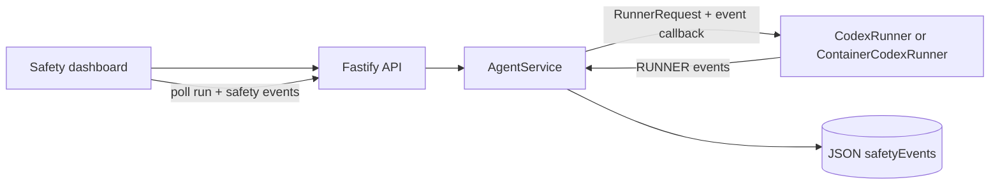

# Member 3: Runner Boundary and Safety Dashboard

## Start the demo locally

Use the project POC command for the end-to-end demo. It starts the configured
runtime and serves the built dashboard from one address:

```bash
cd /Users/chenxiaohe/TeamTree
ARK_API_KEY=your-ark-api-key ARK_MODEL=ep-your-endpoint-id npm run poc
```

Open <http://localhost:3000>. Keep the terminal running while testing. Press
`Ctrl+C` when finished; Agent data remains available for the next run.

For frontend-only development, `npm run dev` starts the Vite UI at
<http://localhost:5173> and the API at <http://localhost:3000>. Use `npm run
poc` for the presentation because it exercises the actual Runner path.

## Architecture



The Runner makes execution decisions while `AgentService` persists associated
events with the current `runId` and `agentId`. The callback is intentionally
optional, so the existing Runner interface and local/container execution paths
remain unchanged for callers that do not need event persistence.

## Existing execution protections

Both Runner implementations enforce a configurable timeout, output byte limit,
and termination path. `CodexRunner` sends `SIGTERM` then escalates to `SIGKILL`.
`ContainerCodexRunner` removes the named runtime container and falls back to
the same process termination path.

The container invocation additionally uses:

- `no-new-privileges` and dropped Linux capabilities;
- configured CPU, memory, and PID limits;
- a non-root configured container user;
- a bind-mounted Agent workspace and Codex home only;
- a separate disposable container per Agent execution.

These are runtime isolation controls. The dashboard events are application
observability controls and do not replace the sandbox.

## Demo sequence

1. Send a normal Agent request. Show `RUNNER / ALLOW - Execution started` and
   the **Safety: Protected** badge.
2. Start a long request and press **Stop Run**. Show `RUNNER / CANCELLED - User
   stopped execution` and **Safety: Run stopped**.
3. Configure a small output limit for the demo, run a verbose command, and show
   `RUNNER / BLOCK - Output limit exceeded` and **Safety: Blocked**.
4. Open the event timeline and explain boundary, decision, reason, and time.

## API used by the dashboard

`GET /api/runs/:id/safety-events` returns persisted, chronological events for a
run. The UI fetches them when a run is selected and alongside existing active
run polling.
